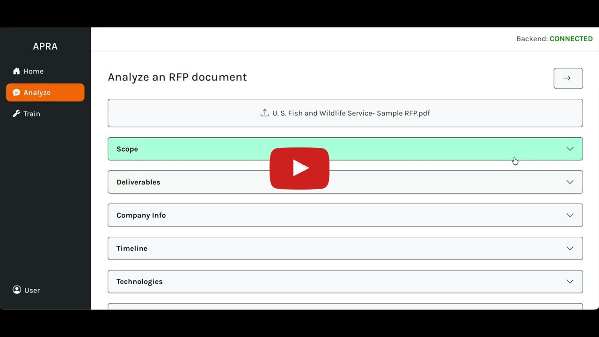

# Welcome to APRA, an AI-Powered RFP Analyzer tool!

[](https://youtu.be/tdB5w8C_42o)

## Main features:
### Analyze a Request for Proposal (RFP) document with just one click of a button.
* APRA uses a SetFit Transformer model on HuggingFace to classify sections of text into 5 distinct categories: Scope, Deliverables, Company Info, Timeline, and Technologies.
* Next, it tags relevant keywords using spaCy's NER model.
* Finally, it uses the Llama 3 70B LLM to summarize each category and provide actionable insights and next steps.

### Want a more personalized experience? Fine-tune the classifier model with your own data.
* Upload your own RFP documents or pre-labeled json files to train the classifier model and improve accuracy.

## Try it out for yourself:
Retrieve an OpenRouter API key of your own: https://openrouter.ai/. 

Install Docker if you haven't already: https://docs.docker.com/get-started/get-docker/.

Download the `docker-compose.yml` and `.env.example` files in this repo. Replace the API_KEY in `.env.example` with your own OpenRouter API key.

Then, after launching Docker Desktop, navigate to the same folder as the `docker-compose.yml` and `.env.example` files in your terminal window. Execute the following commands in your terminal:

1. Run: ```cp .env.example .env```
2. Download the public Docker images:
```bash
docker pull mottur/apra-client:latest
docker pull mottur/apra-api:latest
```
3. Finally, run: ```docker-compose up```

Navigate to https://localhost/8000 to try out the app!

### Credits
This repository includes and makes use of the following models:
- SetFit fine-tuned model — see `classifier/README.md` for full license and credit details.
- spaCy NER model — built using spaCy, © Explosion AI, licensed under the MIT License and hosted on Hugging Face: https://huggingface.co/spacy/en_core_web_trf.
- Llama 3 70B Instruct — model by Meta, used via OpenRouter (free tier). Licensed under the Meta Llama 3 Community License Agreement. Found at: https://openrouter.ai/meta-llama/llama-3.3-70b-instruct:free.

Music in demo by <a href="https://pixabay.com/users/momotmusic-36971640/">Kyrylo Momot (MomotMusic)</a> from <a href="https://pixabay.com/music/corporate-a-soft-tech-179899/">Pixabay</a>.

### License
This project is covered under the terms of the [LICENSE](./LICENSE) file.

© 2025 ASSYST. All rights reserved.